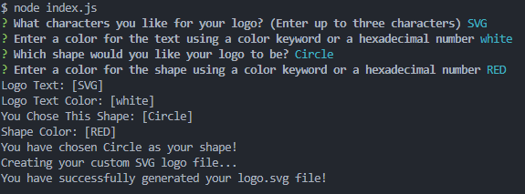

# SVG Logo Maker

## Description

This application use for generating the SVG logo for you. This application help me learn about Node.js and Object oriented programming. This application help me learn about classes and test cases. I learn about npm install, how to run npm run test, and how to work with prompt. This application helps me understand more deeper about how node.js works and also helps me understand how to work with SVG in html. 

## Usage
This is npm test result and examples on how to use this application.

[SVG generate logo walkthrough video click here!](https://drive.google.com/file/d/1J9xHdmlX_5088UqkekuDkWiYjeaDrwIA/view)

This is 3 examples that I created

## Credits
me, my peers, my instructor, tutoring sessions, and Xpert learning assistance.

## License
MIT licensed
